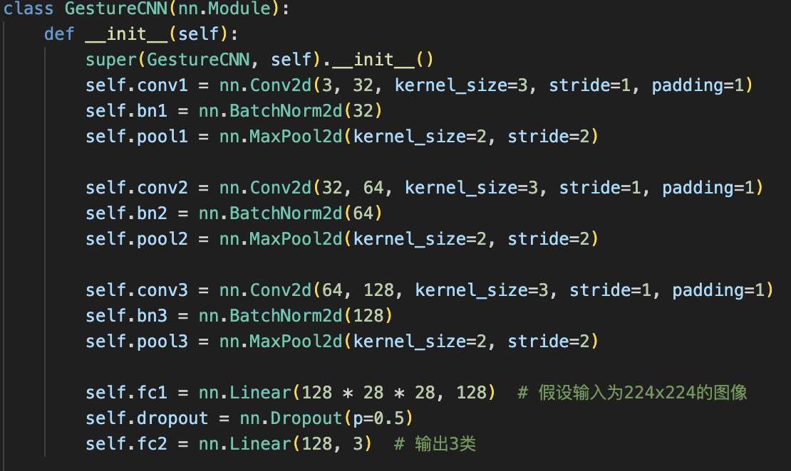
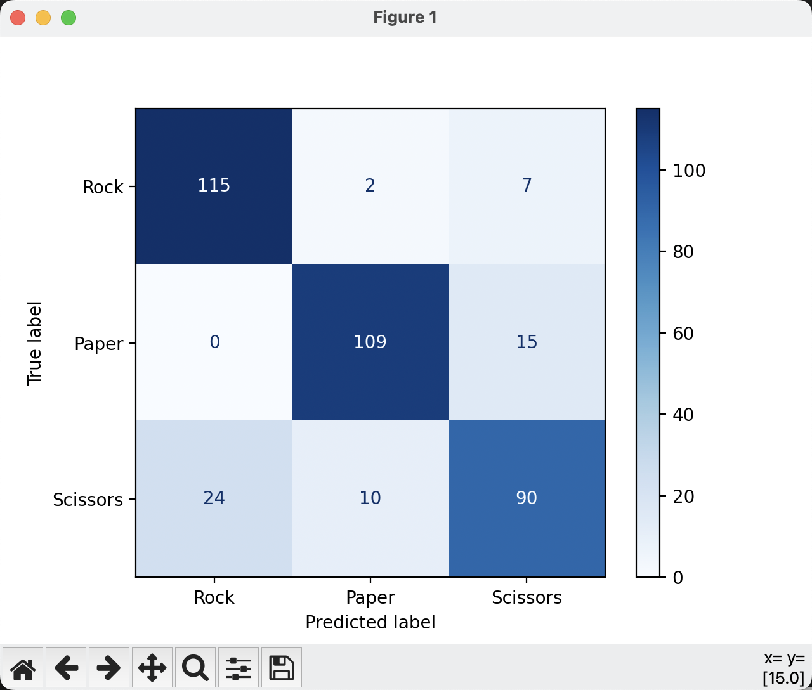
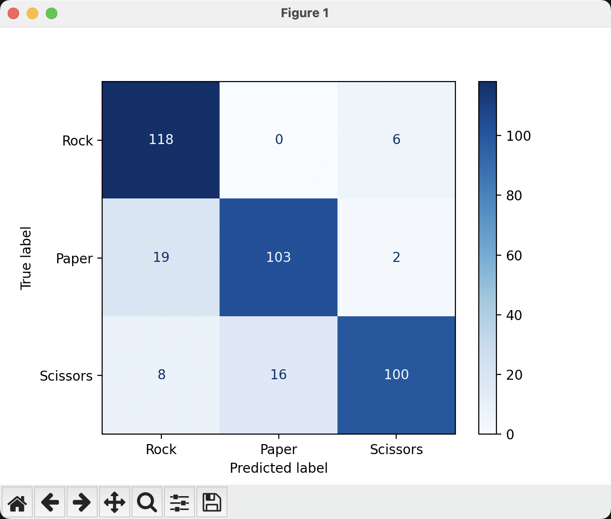

1 初始训练结果

卷积网络如下：

已经可以在training loss/accuracy 和 validation loss/accuracy 上达到100%的水平，但是测试集的精度如下只有84.4%/86.6%，尤其是在scissor上的识别效果非常不好，有24个样本被判定为rock，有10个样本被判定为paper。当然，这个和数据集里他们的图片长相模凌两可有关（报告里面展示图像分析）。

test accuracy: 84.4%

test accuracy:86.6%

· 下一步的优化思路和想法
训练集和测试集的比例2524:376
i） 既然scissor识别不好，先对其做数据增强，人对 CNN 能做的最大影响只有是改变输入。检查数据集的数量分布（报告中展示，数据均匀分布）。对scissor做随机旋转，水平翻转，随机缩放等等。但这会改变数据集的平衡性，有待商榷，但是可以做实验比较。需要确保training set, validation set and test set分布均衡！

ii）网络结构层面调整

a）增加模型深度或宽度：如果数据足够，适当增加卷积层的层数或增加每一层的通道数，例如将第三层卷积的通道数从 128 提高到 256。使用更复杂的激活函数：尝试使用 LeakyReLU 或 Swish 代替 ReLU，以避免梯度过于稀疏。
b）使用全局池化：替换全连接层前的展平操作（Flatten）为全局平均池化（Global Average Pooling, GAP），减少模型参数，提升泛化能力。

    self.global_pool = nn.AdaptiveAvgPool2d((1, 1))

c）正则化：可以使用Dropout层，丢弃率设置为0.5或者0.3

    self.dropout = nn.Dropout(p=0.5)

或者使用权重衰减，L2正则化，在优化器当中添加权重衰减系数

    optimizer = torch.optim.Adam(model.parameters(), lr=0.001, weight_decay=1e-5)

d）批归一化 Batch Normalization：在每一层卷积层后添加 BatchNorm，帮助模型稳定训练并防止过拟合。

    self.bn1 = nn.BatchNorm2d(32)

iii）针对训练策略的优化：Early Stopping 
监控验证集的损失，当损失连续若干轮不下降时提前停止训练，避免过拟合。

iv）使用更强大的优化器，如 AdamW 或 Ranger，以提升模型性能

v）考虑到数据集中图像的不一致性，混合数据集之后，识别准确度100%

训练结果：
- 使用vanila版本网络代码+rps_new,rps-test-set_new，epoch 5左右, 参杂训练集和测试集，可以达到100%准确率
- vanila,原始数据集，epoch 10, 准确率86.6%
- 

